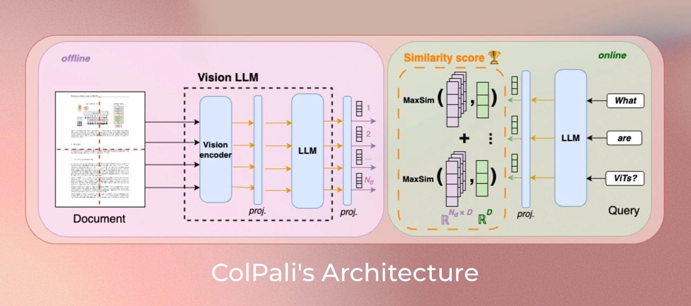

<div align="center">
    <h1 align="center">Serving ColPali with BentoML</h1>
</div>

*ColPali* leverages VLMs to construct efficient multi-vector embeddings in the visual space for document retrieval. By feeding the ViT output patches from PaliGemma-3B to a linear projection, ColPali create a multi-vector representation of documents. The model is trained to maximize the similarity between these document embeddings and the query embeddings, following the ColBERT method.

Using ColPali removes the need for potentially complex and brittle layout recognition and OCR pipelines with a single model that can take into account both the textual and visual content (layout, charts, ...) of a document.



This is a BentoML example project, demonstrating how to build a ColPali inference API server for ColPali. See [here](https://github.com/bentoml/BentoML?tab=readme-ov-file#%EF%B8%8F-what-you-can-build-with-bentoml) for a full list of BentoML example projects.

> [!NOTE]
> The recommended ColPali checkpoint for this repository is [`vidore/colpali-v1.2`](https://huggingface.co/vidore/colpali-v1.2).

Fore more information on ColPali, please refer to:

- The original ColPali arXiv paper: [*ColPali: Efficient Document Retrieval with Vision Language Models*](https://arxiv.org/abs/2407.01449) 📝
- The official ColPali blog post: [HuggingFace Blog](https://huggingface.co/blog/manu/colpali) 🤗
- The code/package for ColPali: [colpali-engine](https://github.com/illuin-tech/colpali). 🧑🏻‍💻

## Install dependencies

```bash
git clone https://github.com/bentoml/BentoColPali.git
cd BentoColPali

# Supports Python 3.9+
pip install -r requirements.txt
```

## Build the model

Before running the BentoML service, you need to download the ColPali model checkpoint and build the model using the following command:

```bash
python bentocolpali/models.py --model-name vidore/colpali-v1.2 --hf-token <YOUR_TOKEN>
```

> [!IMPORTANT]
> Because ColPali uses the PaliGemma (Gemma-licensed) as its VLM backbone, the account associated to the input HuggingFace token must have accepted the terms and conditions of [`google/paligemma-3b-mix-448`](https://huggingface.co/google/paligemma-3b-mix-448).

## Run the BentoML Service

We have defined a BentoML Service in `service.py`. Run `bentoml serve` in your project directory to start the Service.

```bash
bentoml serve .
```

The Service is accessible at [http://localhost:3000](http://localhost:3000/). You can interact with it using the Swagger UI or in other different ways:

### With CURL

You can query the service using the following snippet (the strings in the `base_64` fields are dummy examples):

```bash
curl -X POST -H "content-type: application/json" --data '{
    "queries": [
        "How does the positional encoding work?",
        "How does the scaled dot attention product work?"
    ],
    "images": [
        {
            "url": "data:image/png;base64,iVBORw0KGgoAAAANSUhEU..."
        },
        {
            "url": "data:image/png;base64,iVBORw0KGFEWAAAANSUhU..."
        }
    ]
}' http://localhost:3000/score
```

...which should result a response similar to the following JSON:

```json
{
  "score": [
    [15.25727272, 6.47964382],
    [11.67781448, 16.54862022]
  ]
}
```

### With a Python client

```python
import bentoml
from PIL import Image

from bentocolpali.interfaces import ImagePayload
from bentocolpali.utils import convert_pil_to_b64_image

image_filepaths = ["page_1.jpg", "page_2.jpg"]
image_payloads = []
for filepath in image_filepaths:
    image = Image.open(filepath)
    image_payloads.append(ImagePayload(url=convert_pil_to_b64_image(image)))

queries = [
    "How does the positional encoding work?",
    "How does the scaled dot attention product work?",
]

with bentoml.SyncHTTPClient("http://localhost:3000") as client:
    image_embeddings = client.embed_images(items=image_payloads)
    query_embeddings = client.embed_queries(items=queries)

    scores = client.score_embeddings(
        image_embeddings=image_embeddings,
        query_embeddings=query_embeddings,
    )

print("Scores:", scores)
```

## Deploy to BentoCloud

After the Service is ready, you can deploy the application to BentoCloud for better management and scalability. [Sign up](https://www.bentoml.com/) if you haven't got a BentoCloud account.

Make sure you have [logged in to BentoCloud](https://docs.bentoml.com/en/latest/bentocloud/how-tos/manage-access-token.html), then run the following command to deploy it.

```bash
bentoml deploy bento
```

Once the application is up and running on BentoCloud, you can access it via the exposed URL.

**Note**: For custom deployment in your own infrastructure, use [BentoML to generate an OCI-compliant image](https://docs.bentoml.com/en/latest/guides/containerization.html).

## Citation

**ColPali: Efficient Document Retrieval with Vision Language Models**  

Authors: **Manuel Faysse**\*, **Hugues Sibille**\*, **Tony Wu**\*, Bilel Omrani, Gautier Viaud, Céline Hudelot, Pierre Colombo (\* denotes equal contribution)

```latex
@misc{faysse2024colpaliefficientdocumentretrieval,
      title={ColPali: Efficient Document Retrieval with Vision Language Models}, 
      author={Manuel Faysse and Hugues Sibille and Tony Wu and Bilel Omrani and Gautier Viaud and Céline Hudelot and Pierre Colombo},
      year={2024},
      eprint={2407.01449},
      archivePrefix={arXiv},
      primaryClass={cs.IR},
      url={https://arxiv.org/abs/2407.01449}, 
}
```
